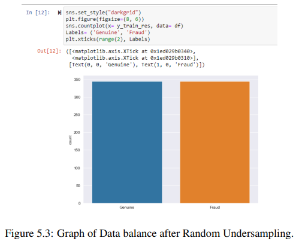
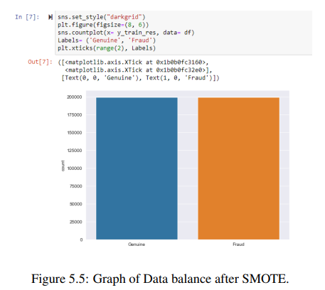
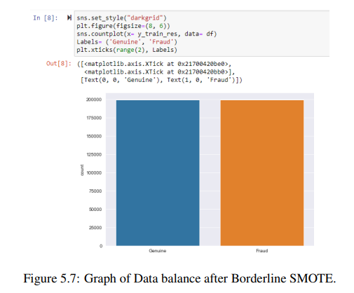
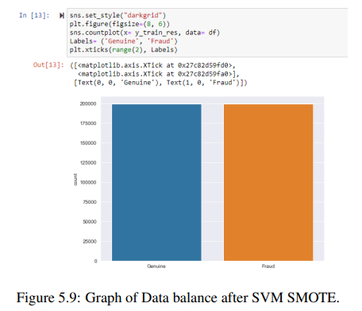
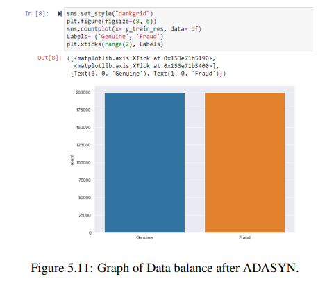
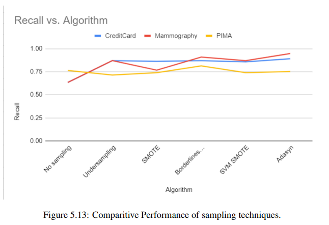

# Empirical Analysis of Sampling methods on Imbalanced Data
Imbalanced data refers to uneven distribution of classes within a data-set. It occurs when one class has comparatively more observations than others.Due to this imbalance in the data-set, the trained model shall be biased over majority class. In order to overcome this bias, and to train a balanced dataset,we have used several sampling methods to balance the dataset and have compared the results.

## Design

1. Data Collection
2. Data Preparation
3. Choose a model
4. Train the model
5. Evaluate the model
6. Parameter Tuning
7. Make Predictions

## Installation

[Python](https://www.python.org//) v3.7.0+ is required, to run.

Install the libraries.

```sh
pip install numpy
pip install pandas
pip install sklearn
pip install imblearn
pip install matplotlib
pip install streamlit
```
## Development

These are the steps to run after opening a terminal:

Step 1:

```sh
Load and Read dataset
```

Step 2:

```sh
Split dataset into train and test
```

Step 3:

```sh
Apply regression model and check results
```
Step 4:

```sh
Apply and run sampling methods on the training dataset
```
Step 5:

```sh
Apply regression model on sampled dataset and compare results.
```


## **Results**
<hr/>

### **Random Undersampling**

<br>

<p align="center">

</p>
<hr/>

### **Smote**

<br>

<p align="center">

</p>
<hr/>

### **Boderline Smote**

<br>

<p align="center">

</p>
<hr/>

### **SVM Smote**

<br>

<p align="center">

</p>
<hr/>

### **Adasyn**

<br>

<p align="center">

</p>
<hr/>

## **Comparision**

<br>

<p align="center">

</p>
<hr/>


## **Conclusion**

<br>

Working on imbalanced datasets directly gives very low accuracy and other low metric
parameter values. Hence it is definitely required to balance the classes of such datasets
before applying any algorithm and working on the data. This balance can be brought about
by many sampling techniques like Random undersampling, SMOTE, Borderline SMOTE,
SVM SMOTE and ADASYN. As a result of comparison of performance metrics of these
five sampling techniques across two datasets, ADASYN sampling algorithm proved to be
the one offering the highest recall value and accuracy after balancing the data.
